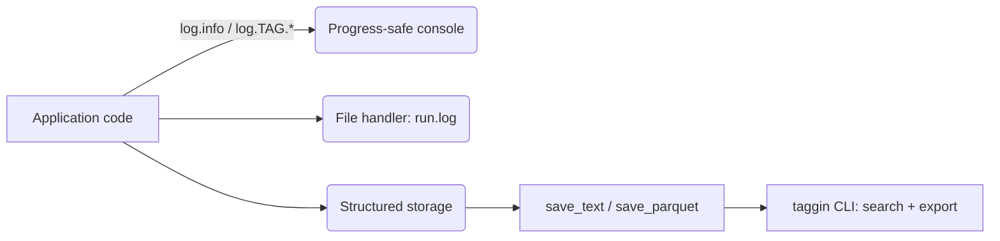

# Taggin

Taggin is a tiny layer atop Python's stdlib logger that lets you treat method
access as dynamic tags while mirroring every record into a searchable store.
Use attribute access such as `log.TRAIN.BATCH("...")`, filter by glob patterns,
rate-limit noisy categories, and export the captured history to text or Parquet
for lightweight analytics.


If your renderer supports it, the Mermaid diagram below shows the same flow in
text form:



## Features

- **Magic tags** – any attribute chain on a logger becomes a structured tag.
- **Structured storage** – every record (timestamp, level, name, tag, message)
  is retained in-memory for later saving or searching.
- **CLI explorer** – the `taggin` CLI (built with Cyclopts) supports date,
  tag, and fuzzy searches with optional JSON output.
- **Progress-safe console handler** – won't break tqdm/alive-progress bars.
- **Optional color + emoji** – enable Rich-driven styling via
  `setup_logger(enable_color=True)` and `set_tag_style`.

Tags are **case-sensitive** and are simply the dotted attribute chain you
call—`log.TRAIN.EPOCH` is distinct from `log.train.epoch`—so you can mix
upper- and lower-case conventions to match your project.

## Quick Start

```python
from datetime import datetime
from taggin import (
    setup_logger,
    set_visible_tags,
    get_log_storage,
    set_tag_style,
)

log = setup_logger(console_level="INFO", enable_color=True)
set_visible_tags(["TRAIN.*", "io.net"])
set_tag_style("TRAIN.START", color="green", emoji="🚂")

log.info("Booting system")
log.TRAIN.START("epoch=%s", 1)
log.io.net("connected to redis")

storage = get_log_storage()
storage.save_text("logs/run.txt")
storage.save_parquet("logs/run.parquet")  # requires pandas + pyarrow

recent = storage.search_by_date(start=datetime.utcnow().replace(hour=0, minute=0))
train = storage.search_by_tag("TRAIN.*")
issues = storage.search_fuzzy("redis timeout", threshold=0.5)
```

The console defaults to hiding tagged logs; opt into categories with
`set_visible_tags`, `TAGGIN_LOG_TAGS=*`, or glob patterns like
`TAGGIN_LOG_TAGS="TRAIN.* io.*"`. Tagged messages always go to file and the
structured store regardless of this filter.

Set `enable_color=False` (default) to keep plain console output.

## CLI Search

```bash
taggin by-tag logs/run.txt "TRAIN.*"
taggin by-date logs/run.parquet --start "2025-01-01" --end "2025-01-05"
taggin fuzzy logs/run.txt "redis timeout" --threshold 0.4 --limit 5 --json-output
taggin tags logs/run.txt                    # show each tag with its count
taggin tags logs/run.txt --json-output      # emit the same counts for tooling
```

Each search command prints human-readable text or JSON (`--json-output`) for
downstream automation, while `taggin tags` displays a frequency-sorted summary
so you can see the busiest categories at a glance.

JSON responses from `by-*`/`fuzzy` follow this schema so you can pipe into
jq/Node/Python tooling without extra parsing:

```json
[
  {
    "timestamp": "2025-01-05T10:00:01.234567",
    "level": "INFO",
    "name": "my.module",
    "tag": "TRAIN.EPOCH",
    "message": "epoch=1 acc=0.92"
  }
]
```

## Installation & Development

```bash
pip install taggin
pytest  # run the tests
mkdocs serve  # preview docs
```

The documentation site uses the Material theme, so make sure `mkdocs-material`
is installed (e.g., `pip install -e ".[dev]"` or `pip install mkdocs mkdocs-material`) before running `mkdocs serve`.

### Runtime configuration quick reference

- `TAGGIN_LOG_TAGS` – comma/space-separated glob list for console visibility.
  Use `*`/`ALL` to show everything or leave empty to hide all tagged lines.
- `TAGGIN_TAG_LEVEL` – default log level for tagged messages (e.g., `DEBUG`).
- `set_visible_tags([...])` / `set_tag_level` / `set_tag_rate_limit` – runtime
  APIs for dynamic filtering, level overrides, and tag throttling.
- `set_tag_style` + `enable_color=True` – add colors/emoji to tagged console
  output while keeping the same structured record layout on disk.
